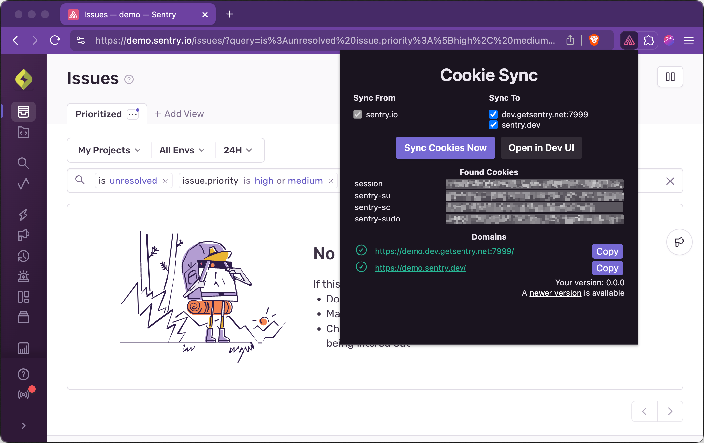

# Sentry.io Cookie Sync

A browser extension to automatically sync cookies for local frontend development of `sentry.io`. The extension copies cookies from `sentry.io` and makes them available to your development environment, including version sandbox deployments.

## Installation

You can install the latest published version from:

- [Get Cookie Sync for Chrome](https://chrome.google.com/webstore/detail/sentry-cookie-sync/kchlmkcdfohlmobgojmipoppgpedhijh)
- [Get Cookie Sync for Firefox](https://addons.mozilla.org/en-US/firefox/addon/sentry-cookie-sync/)

## Manual Installation

Download the packaged extension from the [GitHub releases page](https://github.com/getsentry/cookie-sync/releases).

Auto-update does not work for manual installs.

### Chrome

1. Visit `chrome://extensions`.
2. Enable `Developer Mode`.
3. Drag and drop the downloaded Chrome zip into the page, or use `Load unpacked` with the Chrome build output.

### Firefox

1. Get an [ESR](https://www.mozilla.org/en-US/firefox/enterprise/), [Developer](https://www.mozilla.org/en-US/firefox/developer/), or [Nightly](https://www.mozilla.org/en-US/firefox/channel/desktop/#nightly) build of Firefox.
2. Follow Mozilla's instructions for unsigned add-ons [here](https://support.mozilla.org/en-US/kb/add-on-signing-in-firefox#w_what-are-my-options-if-i-want-to-use-an-unsigned-add-on-advanced-users).
3. Visit `about:addons`.
4. Drag and drop the downloaded Firefox zip into the page.

### Safari

The full extension is not available on Safari. You can still use the extension in Firefox or Chrome to copy cookies manually into Safari:

1. Log in to production and the target Safari domain.
2. Open the extension and click `Sync Cookies Now`.
3. Click `Copy` for the domain you want.
4. Paste the copied `document.cookie=...` snippet into Safari's JavaScript console.

## Development

Requirements:

- [Node.js](https://nodejs.org) 20 or later
- [pnpm](https://pnpm.io)

Common commands:

- `pnpm install`
- `pnpm run dev`
- `pnpm run dev:firefox`
- `pnpm run build`
- `pnpm run build:firefox`
- `pnpm run zip`
- `pnpm run zip:firefox`

WXT writes build output to `.output/`.

### Test In Dev Mode

1. Run `pnpm install`.
2. Run `pnpm run dev` for Chrome or `pnpm run dev:firefox` for Firefox.
3. Load the generated extension from `.output/`.

Chrome unpacked output is written under `.output/chrome-mv3/`.

Firefox unpacked output is written under `.output/firefox-mv2/`.

### Test Production Builds

- `pnpm run zip`
- `pnpm run zip:firefox`

These commands generate the browser zips in `.output/`. The Firefox zip command also generates the sources zip required for store review.

`package.json` is the only version source. CI updates it before building release artifacts.

## Publishing

New versions are published to the Chrome Web Store and Firefox Add-ons through GitHub Actions using WXT's zip and submit flow.

Firefox reviewer rebuild instructions are documented in [SOURCE_CODE_REVIEW.md](./SOURCE_CODE_REVIEW.md).

## Bugs

Please file issues for feature requests, bugs, missing documentation, or unexpected behavior in [GitHub issues](https://github.com/getsentry/cookie-sync/issues).

## License

[MIT ©](https://github.com/getsentry/cookie-sync/blob/main/LICENSE)
